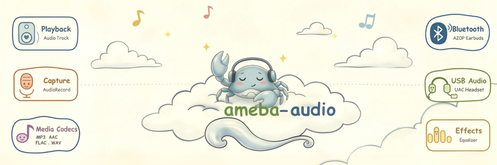

<div align="center">



# ameba-audio

**The audio framework for Realtek Ameba series chips — playback, capture, codecs, effects and voice.**

[](https://aiot.realmcu.com/en/latest/rtos/index.html)
[](https://github.com/Ameba-AIoT/ameba-rtos)
[](https://github.com/Ameba-AIoT/ameba-rtos)
[](LICENSE)

[English](README.md) · [Documentation](https://aiot.realmcu.com/en/latest/rtos/index.html) · [ameba-rtos](https://github.com/Ameba-AIoT/ameba-rtos)

</div>

ameba-audio is the official audio middleware for Realtek Ameba series SoCs. It provides a layered stack — from the streaming APIs (`AudioTrack` / `AudioRecord`) down through the audio HAL and codec/amplifier drivers — plus a media player, hardware effects, USB and Bluetooth A2DP audio devices, and voice activity detection. It is delivered as a submodule of [ameba-rtos](https://github.com/Ameba-AIoT/ameba-rtos) and is part of the **XDK (Extended)** download.

## 🔌 Supported Chips

| Chip                   |          master          |     release/v1.2         |     release/v1.1         |     release/v1.0         |
|:---------------------- |:------------------------:|:------------------------:|:------------------------:|:------------------------:|
| AmebaSmart (RTL8730E)  | ![alt text][supported]   | ![alt text][supported]   | ![alt text][supported]   | ![alt text][supported]   |
| AmebaLite (RTL8720E)   | ![alt text][supported]   | ![alt text][supported]   | ![alt text][supported]   | ![alt text][supported]   |
| AmebaDplus (RTL8721Dx) | ![alt text][supported]   | ![alt text][supported]   | ![alt text][supported]   | ![alt text][supported]   |
| AmebaGreen2            | ![alt text][supported]   | ![alt text][not-support] | ![alt text][not-support] | ![alt text][not-support] |

[supported]: https://img.shields.io/badge/-supported-green "supported"
[not-support]: https://img.shields.io/badge/-not%20support-red "not support"

> Per-chip feature availability follows the target's Kconfig. Refer to the online SDK documentation for the definitive per-chip feature matrix.

## 🏗️ Repository Structure

```text
ameba-audio/
├── interfaces/          # Public headers — the API surface
│   ├── audio/           #   AudioTrack, AudioRecord, Manager, Equalizer, VAD, types
│   ├── media/           #   MediaPlayer, stream source, parcel
│   ├── hardware/        #   HAL-facing hardware interfaces
│   ├── usb_audio/       #   USB audio (UAC) manager
│   └── common/          #   Shared types and error codes
├── audio_hal/           # Hardware abstraction layer (per-SoC + common)
│   ├── amebasmart/      #   AmebaSmart (RTL8730E) HAL
│   ├── amebalite/       #   AmebaLite (RTL8720E) HAL
│   ├── amebadplus/      #   AmebaDplus (RTL8721Dx) HAL
│   ├── amebagreen2/     #   AmebaGreen2 HAL
│   ├── a2dp/            #   Bluetooth A2DP audio device
│   ├── usb/             #   USB audio device
│   └── common/          #   Stream buffer, params handling, debug
├── audio_driver/        # Codec / amplifier drivers (e.g. HT513, dummy amp)
├── media_registry/      # Runtime registry of demuxers and codecs
├── base/                # Utilities: cutils, log, osal, xlib
├── foundation/          # AHandler / ALooper / AMessage message framework
├── configs/             # Audio policy and build-time hardware configs
├── cmds/                # Console commands: aplay, arecord, player, equalizer, vad …
├── examples/            # Runnable examples (HAL render/capture, manager, speexdsp …)
├── third_party/         # Codec libs: haac, flac, libopus, tremolo, libgsm, speexdsp
├── libs/                # Prebuilt per-SoC binaries
├── audio_prebuilts/     # Prebuilt per-SoC binaries
├── Kconfig              # Menuconfig options
└── CMakeLists.txt       # Component build entry
```

## ✨ Key Features

- **Playback** — streaming audio output with volume, latency and timestamp query; thread-safe synchronous API
- **Capture** — streaming audio input with configurable rate, channels and format
- **Two architectures** — selectable **Mixer** (multi-stream software mixing) or **PassThrough** (low-overhead direct routing via `AudioManager` audio patch)
- **Media Player** — file/stream playback with pluggable demuxers and codecs: **WAV, MP3, AAC, M4A, FLAC, AMR, OGG (Vorbis / Opus)**
- **Effects** — equalizer, drc and so on
- **Bluetooth A2DP** — A2DP sink / source audio device integration
- **USB Audio** — UAC device support
- **Amplifier drivers** — pluggable external amplifier support (e.g. HT513)
- **Console commands** — `aplay`, `arecord`, `player`, `pcrecord`, `equalizer`, `equalizer_tune` for quick bring-up and testing

## 📚 Documentation

Documentation for the latest version: [FreeRTOS SDK and User Guide](https://aiot.realmcu.com/en/latest/rtos/index.html) — build system, per-SoC guides and the full audio application notes.

- API reference: the annotated public headers under [`interfaces/`](interfaces)
- Per-SoC HAL notes: `audio_hal/<soc>/README.md`

For more information on the Ameba series chips, visit the [product page](https://aiot.realmcu.com/en/product/index.html).

## 📥 SDK Download

ameba-audio is delivered as a submodule of [ameba-rtos](https://github.com/Ameba-AIoT/ameba-rtos) and is only pulled in with the **XDK (Extended)** checkout:

```bash
git clone --recurse-submodules https://github.com/Ameba-AIoT/ameba-rtos.git
```

If you already cloned ameba-rtos without submodules:

```bash
git submodule update --init --recursive component/audio/ameba-audio
```

> The Basic SDK checkout does not include `component/audio/ameba-audio`. To build any audio feature you must use the XDK checkout above.

## 🚀 Quick Start

Configure, build and flash for a supported SoC (from the ameba-rtos root):

```bash
source env.sh                 # set up the toolchain (Linux; use env.bat on Windows)
ameba.py soc AmebaSmart       # e.g. AmebaSmart / AmebaLite / AmebaDplus / AmebaGreen2
ameba.py menuconfig           # → Audio Config
ameba.py build
ameba.py flash -p <PORT> -b <BAUDRATE> -i <BIN_FILE> <START_ADDR> <END_ADDR>
ameba.py monitor -p <PORT> -b 1500000
```

Key menuconfig options (see `Kconfig`):

- **Enable Audio Framework** → choose **Mixer** or **PassThrough**
- **Audio Devices** → Bluetooth A2DP, USB
- **Enable Media Player** → select media formats (WAV / MP3 / AAC / M4A / FLAC / AMR / OGG)
- **Audio Commands** → build the console commands under `cmds/`

Hardware wiring (amplifier, PLL vs. XTAL clock, port pins, etc.) is configured per SoC in
`component/soc/usrcfg/<soc>/include/ameba_audio_hw_usrcfg.h`.

### Try a console command

Enable the commands under **Audio Config → CONFIG AUDIO CMD** in menuconfig, then run them from the serial console.

**Play a sine tone** — [`aplay`](cmds/aplay/README.md):

```bash
aplay -r 48000 -c 2 -f 16 -d 20 -v 0.8    # 48 kHz stereo 16-bit, 20 s, volume 0.8
aplay -h                                   # show all options
```

**Record from the microphone** — [`arecord`](cmds/arecord/README.md):

```bash
arecord -r 48000 -c 2 -f 16               # 48 kHz stereo 16-bit capture, loops to speaker
```

**Play a media file** — [`player`](cmds/player/README.md) (MP3 / AAC / FLAC / OGG …):

```bash
player -F http://192.168.31.226/1.mp3     # play a URL
player -F buffer -md 1                     # play from an in-memory data source
```

## 🌐 Accelerate with Gitee

For users who can access [Gitee](https://gitee.com), we recommend downloading the Gitee mirror of [ameba-rtos](https://gitee.com/ameba-aiot/ameba-rtos) to improve download speed if GitHub is slow. The ameba-audio submodule is pulled in the same way.

## 💬 Feedback

- Questions and suggestions: [Real-AIOT Forum](https://forum.real-aiot.com/)
- Bugs and feature requests: [ameba-rtos GitHub Issues](https://github.com/Ameba-AIoT/ameba-rtos/issues) (please search existing issues first)
